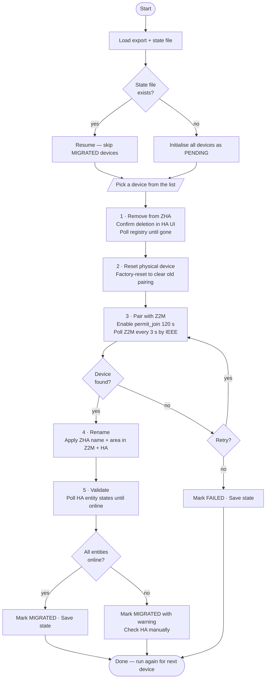
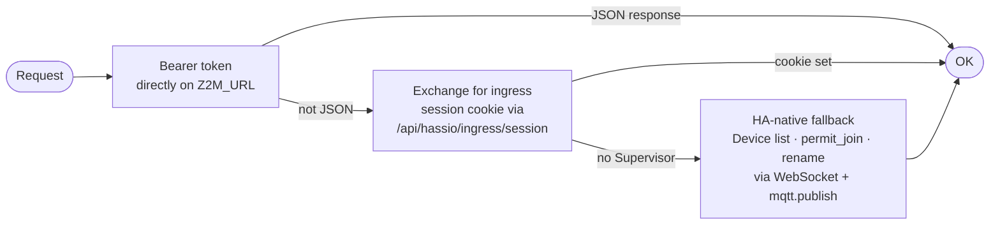
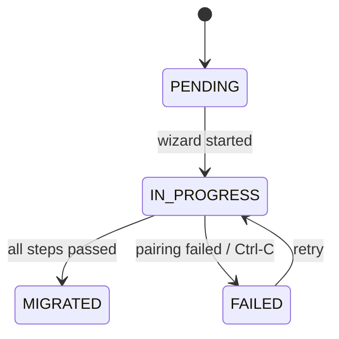

<!-- markdownlint-disable MD013 -->
# zigporter

CLI tool to migrate Zigbee devices from ZHA to Zigbee2MQTT in Home Assistant.
Runs an interactive per-device wizard with persistent state so migrations can
be paused and resumed across sessions.

## Requirements

- Python 3.13+
- [uv](https://docs.astral.sh/uv/)
- Home Assistant with ZHA and Zigbee2MQTT add-on

## Setup

```bash
uv sync
cp .env.example .env   # fill in your values
```

### .env

```dotenv
HA_URL=https://your-ha-instance.local
HA_TOKEN=your_long_lived_access_token
HA_VERIFY_SSL=true                   # false for self-signed certs
Z2M_URL=https://your-ha-instance.local/45df7312_zigbee2mqtt
Z2M_MQTT_TOPIC=zigbee2mqtt           # only if non-default
```

`HA_TOKEN` is a [Long-Lived Access Token](https://www.home-assistant.io/docs/authentication/#your-account-profile) from your HA profile page.

## Usage

```bash
# 1. Export your ZHA device inventory
uv run zigporter export

# 2. (Optional) inspect what's already in Z2M
uv run zigporter list-z2m

# 3. Run the migration wizard
#    ZHA_EXPORT defaults to the most recent zha-export-*.json in the current dir
uv run zigporter migrate [ZHA_EXPORT]

# Check progress without entering the wizard
uv run zigporter migrate --status
```

## Migration wizard

Run once per device. The wizard walks you through five steps:



State is written to `zha-migration-state.json` after every transition.
`Ctrl-C` at any point marks the device `FAILED` and saves — rerun to retry.

## Z2M authentication

The `Z2MClient` tries three strategies in order:



## Architecture

```text
CLI Layer       main.py  (Typer, -h / -v)
    ↓
Command Layer   commands/{export, migrate, list_z2m, compare*, rename*}.py
    ↓
Client Layer    ha_client.py  (WebSocket + REST)
                z2m_client.py (HTTP ingress, three-tier auth)
    ↓
Data Layer      models.py (Pydantic v2)
                migration_state.py (JSON on disk, keyed by IEEE)
```

\* `compare` and `rename` are not yet implemented.

## Device state machine



## Development

```bash
uv run pytest          # all tests
uv run ruff check .    # lint
uv run ruff format .   # format
```
